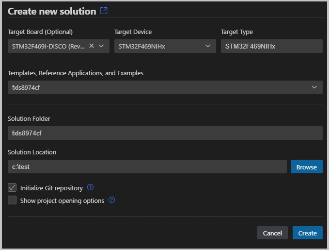
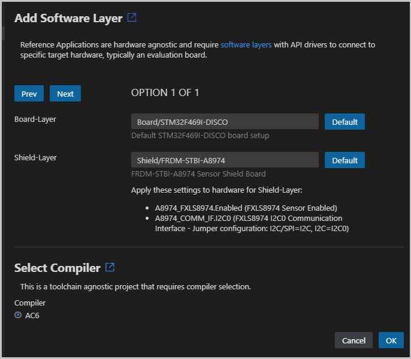
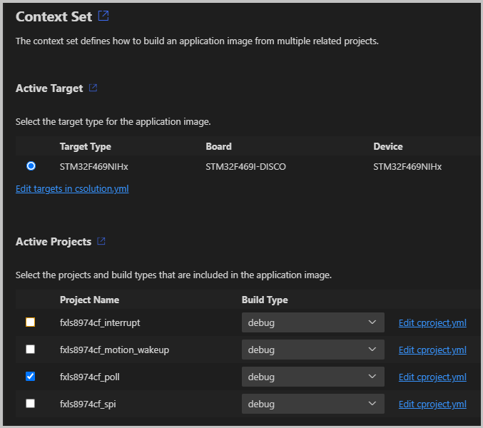

[](https://github.com/Open-CMSIS-Pack/Sensor-SDK-Example/blob/main/LICENSE)
[](https://github.com/Open-CMSIS-Pack/Sensor-SDK-Example/tree/main/.github/workflows/build.yml)

# Sensor-SDK-Example

This software pack demonstrates the usage of [CMSIS-Toolbox &raquo; Reference Applications](https://open-cmsis-pack.github.io/cmsis-toolbox/ReferenceApplications) for the distribution of Sensor interfaces along with example projects. It contains sensor interface middleware that utilizes I2C or SPI [CMSIS-Driver](https://arm-software.github.io/CMSIS_5/Driver/html/index.html) for usage in production code.

The pack is based on the [NXP IoT Sensing Software Development Kit (ISSDK)](https://www.nxp.com/design/design-center/software/sensor-toolbox/iot-sensing-software-development-kit-issdk-embedded-software-framework:IOT-SENSING-SDK) and demonstrates how the CMSIS-Toolbox simplifies the distribution of software frameworks. The example projects that are part of the SDK use interfaces of a board layer that is distributed as part of a Board Support Pack (BSP).  Many board layers are already provided in the BSP packs available on [github.com/Open-CMSIS-Pack](https://github.com/Open-CMSIS-Pack) making it easy to evaluate the NXP sensor Arduino shields with range of different microcontroller boards.


The relevant content of this software pack is in the following directories:

Directory                  | Description
:--------------------------|:------------------------------------
[`sensors`](sensors)       | Interface middleware that connects a sensor to I2C or SPI driver.
[`shields`](shields)       | Contains the mapping of the interface middleware to physical I/O (of an Arduino shield).
[`examples`](examples)     | Demonstrate the usage of the middleware.
[`drivers`](drivers)       | Contains helper functions for the examples.

The Pack Description file [`NXP.ISSDK.pdsc`](NXP.ISSDK.pdsc) defines the software components for [`sensor`](sensors) interface middleware and the [`driver`](drivers) utilities. These software components are used by the [`examples`](examples) but can be also used in the production software.

## Usage

This pack has not public release yet. Download or fork this repository and install it as a [private pack](https://open-cmsis-pack.github.io/cmsis-toolbox/build-tools#install-a-private-software-pack) with:

```bash
cpackget add <path>/NXP.ISSDK.pdsc
```

Select a board that provides a board layer in the BSP with [ARDUINO connections](https://open-cmsis-pack.github.io/cmsis-toolbox/ReferenceApplications#connections). Currently several [ST board BSP](https://github.com/Open-CMSIS-Pack#stm32-packs-with-generator-support) provide such layers, for example the [STM32F469I-DISCO](https://www.keil.arm.com/packs/stm32f469i-disco_bsp-keil/overview/). Add this BSP pack using `cpackget`.

You may now use the [Keil Studio for VS Code](https://www.keil.arm.com/) or the [VS Code CMSIS Solution](https://marketplace.visualstudio.com/items?itemName=Arm.cmsis-csolution) extension and open the **Create New Solution** dialog to select this board and a sensor example.



The IDE will evaluate the compatible software layers and shows the **Configure Solution** view. Depending on the sensor example several options may be available.  Click **OK** to choose a selection.



This completes the setup of the example that now contains the settings for the layers. As the solution contains a collection of similar examples, you may now choose one using the **Manage Solution**.



## Project Structure

This AWS MQTT Mutual Authentication example uses the [CMSIS-Toolbox](https://open-cmsis-pack.github.io/cmsis-toolbox/)
*csolution project format* with CMSIS software packs and software layers. The default configuration uses a AVH-FVP simulation model.
No physical hardware is required to explore this example. By using different layers it can run on physical evaluation boards,
use different communication stacks, or WiFi modules.

Project File                                        | Description
:---------------------------------------------------|:------------------------------------------------
`*.csolution.yml`                                   | Specifies the target hardware, build types, and defines the actual software layers used.
`*.cproject.yml`                                    | Contains the source files and components that belong to one example. Note that the solution may contain multiple similar examples.
`Board/.../Board.clayer.yml`                        | Contains the hardware interfaces to the device and board peripherals.
`Shield/.../Shield.clayer.yml`                      | Contains the pin mapping to the Arduino Shield.

## Configure AWS IoT Thing

Use **Build solution** to translate the application.

### Manual Configuration

Refer to [CMSIS-Toolbox - Reference Applications - Usage](https://open-cmsis-pack.github.io/cmsis-toolbox/ReferenceApplications#usage) for use command line tools to obtain above information.  However you may also use the CMSIS-Toolbox command `csolution list layers` to obtain information about the layers that are available in the installed packs. These layers may be copied to your project directory and defined as shown above.

```bash
csolution list layers
.../Sensor-SDK-Example/shields/a8974/Shield.clayer.yml (layer type: Shield)
.../Sensor-SDK-Example/shields/agm01/Shield.clayer.yml (layer type: Shield)
.../Sensor-SDK-Example/shields/agmp03/Shield.clayer.yml (layer type: Shield)
.../Sensor-SDK-Example/shields/p3115/Shield.clayer.yml (layer type: Shield)
.../Arm/Packs/Keil/STM32F469I-DISCO_BSP/1.0.0/Layers/Default/Board.clayer.yml (layer type: Board)
```

Use **cbuild** to translate the application.

```bash
cbuild xxx.csolution.yml --context .Debug+MyBoard --packs
```

## Build and Run

Once the application is translated use:

- A programmer or debugger to download the application.
- Run the application and view messages in a debug printf or terminal window.

## Potential Improvements

This example pack may be improved by adding links to documentation for each of the software components. Specifically information about the
configuration settings of the sensor interface is missing and needs to be derived from the Shield definitions.

## Issues

Please feel free to raise an [issue](https://github.com/Open-CMSIS-Pack/Sensor-SDK-Example/issues) on GitHub to report problems.
